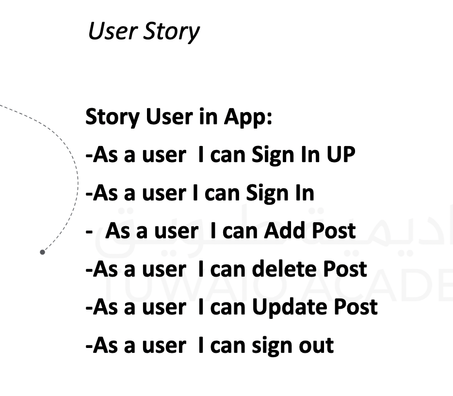
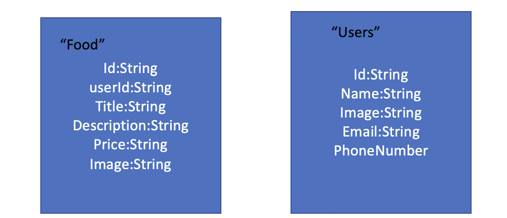
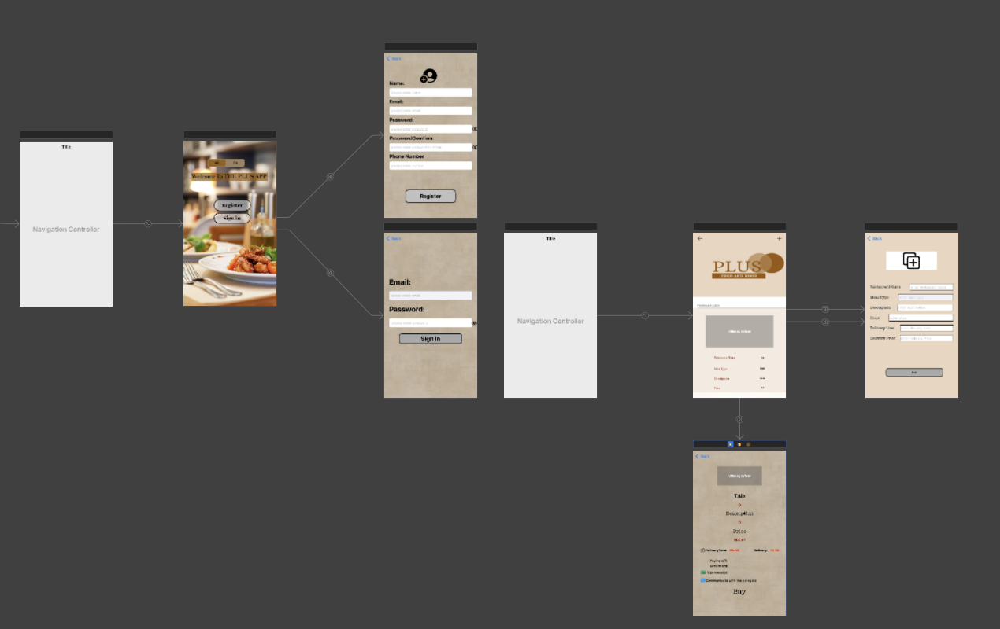

# PlusApp

## Description
- App to display the surplus products from the store, which the commercial store does not benefit from, of any kind, in a buffet, a restaurant, a cafe, a supermarket, a vegetable store, a furniture store, a sweets store, or any other commercial store, and it aims to display the products in a direct way to the beneficiary

## Demo

## User Story

## Framework
- UIKit
- Firebase
- IQKeyboardManagerSwift
- Foundation

## ERD

## Wireframe

